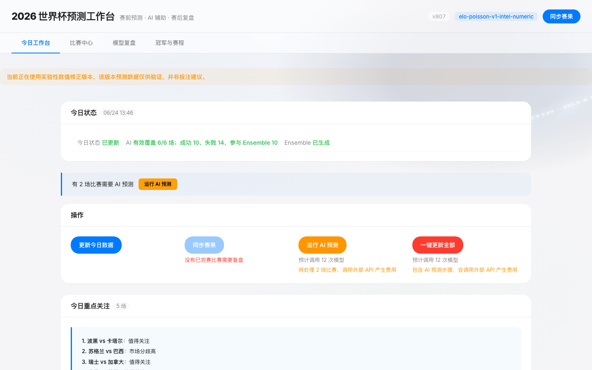
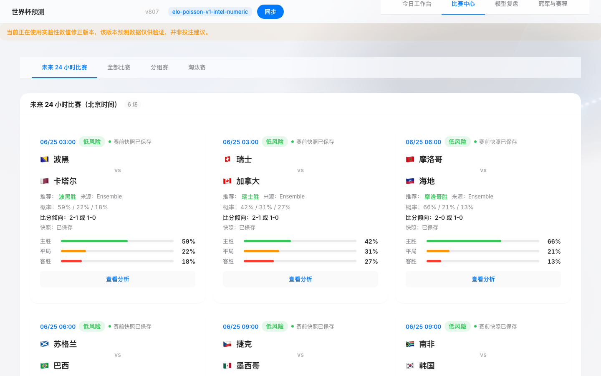
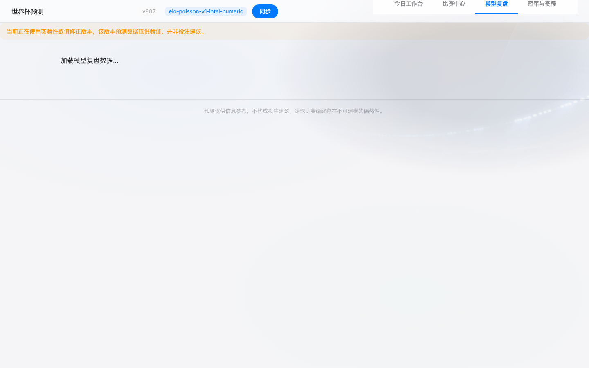
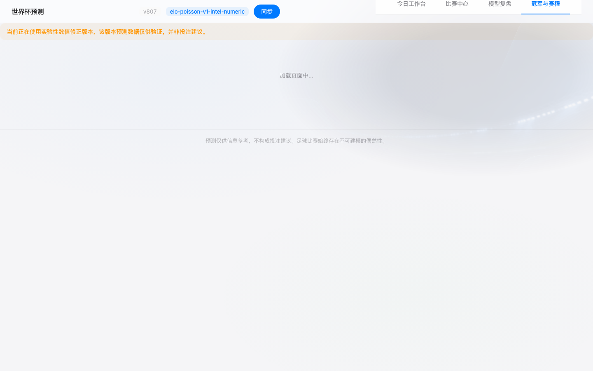

# 2026 FIFA World Cup Prediction Workbench

> **状态：文档已对齐到 2026-06-28 当前实现**

本地优先、多层融合的 2026 FIFA 世界杯预测系统。覆盖 48 支球队、12 个小组、72 场小组赛，支持淘汰赛路径推演、赛前锁定、赛后复盘、AI 融合预测和球队画像。

## 技术栈

| 层级 | 技术 |
|------|------|
| 后端 | FastAPI + SQLAlchemy + SQLite (WAL) + APScheduler |
| 前端 | React 19 + Vite 6 + TypeScript 5.8 + TanStack Query |
| AI | DeepSeek V4 Flash/Pro（含独立提示词 v2 变体） |
| 数学 | Elo 评级 + Poisson 进球模型 + Monte Carlo 模拟 |
| 数据 | OpenFootball + football-data.org + 体彩赔率 + WorldCup26 |

## 快速开始

```bash
# 1. 安装
./scripts/setup.sh

# 2. 配置 API Key（可选，不配置也能运行）
cp .env.example .env
# 编辑 .env 填入 DEEPSEEK_API_KEY

# 3. 启动
./start.sh

# 4. 访问
# 前端: http://127.0.0.1:5173
# 后端: http://127.0.0.1:8000
# API 文档: http://127.0.0.1:8000/docs
```

> 详细步骤请参阅 [QUICK_START.md](QUICK_START.md)

当前首页刷新只会拉取状态和展示数据，不会自动触发工作流。

- `更新今日数据`、`同步赛果`、`运行 AI 预测`、`一键更新全部` 都需要用户手动点击
- `更新今日数据` 和 `同步赛果` 不受 60 分钟冷却限制
- `运行 AI 预测` 受 `WORKFLOW_AUTO_RUN_COOLDOWN_MINUTES` 控制，默认 60 分钟
- 工作流运行中时，首页动作按钮和顶部状态条会显示百分比进度

## 核心功能

### 预测流水线

```
数据同步 → 基线预测 (Elo+Poisson + 市场/画像增强) → AI 预测 → 集成融合 → 赛前决策快照锁定 → 开赛 → 评分
```

1. **基线模型**：`elo-poisson-v1*` 系列生成胜/平/负概率、xG 和比分矩阵；当前重算链路会在市场增强配置下加载球队画像修正、FIFA 排名和实验性数值调整
2. **AI 预测**：多个 AI 模型独立生成预测（v2 提示词不含基线概率，避免锚定偏差）
3. **集成融合**：基线 + 市场赔率 + AI 预测的加权融合，缺失来源自动权重重分配
4. **决策快照**：赛前窗口内写入并维护快照，赛后评分使用开赛前最后一份有效预测
5. **评分**：赛后 Brier 分数、Log Loss、命中率评估，并明确未评分原因

### xG 校准与 Poisson 色散

基线模型已针对 WC 2026 实际数据校准：

| 参数 | v1 | 校准后 | 效果 |
|------|-----|--------|------|
| `base_goal_mean_home` | 1.25 | 1.55 | xG 从 2.37 → ~2.93（实际 3.03） |
| `base_goal_mean_away` | 1.10 | 1.35 | 同上 |
| `strength_coeff_home` | 0.90 | 1.20 | 强弱队 xG 分化更明显 |
| `max_xg` | 3.50 | 4.50 | 允许高比分预测 |
| `poisson_dispersion` | — | 1.10 | 幂变换轻微展平分布 |

回测对比（37 场 WC 2026 比赛）：精确比分 5.4% → 13.5%（2.5 倍），±1 球 73.0% → 75.7%，方向 48.6% → 51.4%，Brier 0.6071 → 0.6096（噪声范围内）。

### AI 预测

- **当前可见模型**：DeepSeek V4 Flash、DeepSeek V4 Pro，以及独立提示词 `worldcup-ai-v2` 的 DeepSeek V4 Flash 变体
- **双提示词**：v1（含基线参考）+ v2（独立判断，无基线泄漏）
- **去重**：跳过已有成功预测的模型（除非 force）
- **单场冷却**：同一场比赛 1 小时内不重复刷新 AI 预测；超过 1 小时可用 `force=true` 手动重跑
- **基线抄袭检测**：标记与系统预测完全一致的 AI 输出
- **独立审计**：`/api/ai-independence` 检查 AI 与基线的偏差程度
- **展示约束**：停用或欠费的 provider/model 不在用户侧首页和模型复盘页展示

### 集成融合

| 场景 | 系统权重 | 市场权重 | AI 权重 |
|------|---------|---------|--------|
| 全部可用 | 35% | 30% | 35% |
| 无市场 | 50% | - | 50% |
| 无 AI | 55% | 45% | - |
| 仅系统 | 100% | - | - |

### 球队画像

- **已接入当前重算链路**：画像特征会通过 `profile_adapter.py` 转换为 `MatchContext` 调整项进入当前 baseline / numerical 重算；独立画像评估结果仍以 `elo-poisson-v1-team-profile` 单独存储，供模型复盘使用
- 使用 Mart Jürisoo 国际比赛结果快照（2022-01-01 至 2026-06-19 已完赛比赛）构建真实历史样本；`seed_mock_v1` 仅作无真实样本时的本地 fallback，并会降低数据可信度
- FIFA 排名优先从 FIFA 官方 FDCP API 导入，当前覆盖 48/48 支球队；Elo/FIFA source 会进入球队画像 `source_list`
- 七个结构化模块：基础实力、近期状态、攻防能力、战术风格、阵容与球员风险、比赛环境适应、数据可信度
- 阵容模块已接入 FIFA 官方 2026-06-20 Squad List，覆盖 48/48 队 26 人名单、位置深度、国家队出场和进球；伤停、停赛和首发确认仍保持 unavailable
- 比赛环境模块已用真实赛程和场地 registry 补充 `rest_days`、`schedule_fatigue_score`、旅行距离、时差、下一场和后续场地；历史气候基线来自 Open-Meteo Historical Weather API，且标记为 `is_match_forecast=false`
- 缺失数据显式标记 `unavailable` / `missing`，不会用 mock 伪装真实伤停、首发、旅行、气候或球员信息
- `data_quality_score` 会列出关键缺失 penalty；StatsBomb xG 只覆盖 2018/2022 世界杯样本，命中球队会在 `attack_defense.xg` 展示样本均值，未覆盖球队保留 `xg=unavailable`
- 前端在球队详情和比赛详情中展示画像分、优势、风险、缺失字段、数据来源和更新时间

详见 [docs/team_profiles.md](docs/team_profiles.md)。

### 赛事模拟

- Monte Carlo 模拟（默认 50,000 次迭代）
- 小组出线概率、淘汰赛晋级路径
- 淘汰赛对阵表生成
- 第三名排名规则

## 架构概览

```
┌─────────────────────────────────────────────────────────┐
│                    Frontend (React + Vite)               │
│  ┌──────────┐ ┌──────────┐ ┌──────────┐ ┌───────────┐  │
│  │  Daily    │ │  Match   │ │  Model   │ │ Tournament│  │
│  │ Dashboard │ │  Center  │ │  Review  │ │ & Schedule│  │
│  └──────────┘ └──────────┘ └──────────┘ └───────────┘  │
└────────────────────────┬────────────────────────────────┘
                         │ REST API
┌────────────────────────▼────────────────────────────────┐
│                   Backend (FastAPI + SQLite)             │
│  ┌──────────┐ ┌──────────┐ ┌──────────┐ ┌───────────┐  │
│  │  Elo +   │ │   AI     │ │ Ensemble │ │  Team     │  │
│  │  Poisson │ │ Models   │ │          │ │  Profile  │  │
│  └──────────┘ └──────────┘ └──────────┘ └───────────┘  │
│  ┌──────────┐ ┌──────────┐ ┌──────────┐ ┌───────────┐  │
│  │  Market  │ │ Scoring  │ │ Snapshot │ │ Workflow  │  │
│  │  Odds    │ │ Engine   │ │  Locking │ │  Engine   │  │
│  └──────────┘ └──────────┘ └──────────┘ └───────────┘  │
└─────────────────────────────────────────────────────────┘
```

> 详细架构说明请参阅 [ARCHITECTURE.md](ARCHITECTURE.md)

## 配置

复制 `.env.example` 到 `.env` 并按需配置：

### 数据库

| 变量 | 默认值 | 说明 |
|------|--------|------|
| `DATABASE_PATH` | `data/world-cup.sqlite3` | SQLite 数据库路径 |

### 数据源

| 变量 | 默认值 | 说明 |
|------|--------|------|
| `FOOTBALL_DATA_API_TOKEN` | 空 | football-data.org API 令牌（可选） |
| `API_FOOTBALL_TOKEN` | 空 | API-Football 令牌（可选） |
| `SPORTMONKS_TOKEN` | 空 | SportMonks 令牌（可选） |

### 调度与模拟

| 变量 | 默认值 | 说明 |
|------|--------|------|
| `SIMULATION_ITERATIONS` | `50000` | Monte Carlo 迭代次数 |
| `SIMULATION_SEED` | `20260613` | 随机种子 |
| `REFRESH_INTERVAL_MINUTES` | `15` | 常规刷新间隔 |
| `LIVE_REFRESH_INTERVAL_MINUTES` | `2` | 比赛期间刷新间隔 |
| `SNAPSHOT_LOCK_INTERVAL_MINUTES` | `1` | 决策快照锁定检查间隔 |
| `ENABLE_SCHEDULED_REFRESH` | `false` | 是否启用后台定时刷新赛果/赛程 |

### AI 预测

| 变量 | 默认值 | 说明 |
|------|--------|------|
| `ENABLE_AI_PREDICTION` | `true` | 是否启用 AI 预测 |
| `AI_RUN_MODE` | `manual` | 运行模式：`manual` / `auto` |
| `DEEPSEEK_API_KEY` | 空 | DeepSeek API 密钥 |
| `DEEPSEEK_BASE_URL` | `https://api.deepseek.com` | DeepSeek API 地址 |
| `AI_TEMPERATURE` | `0` | AI 采样温度 |
| `AI_TIMEOUT_SECONDS` | `30` | 请求超时（秒） |
| `AI_MAX_RETRIES` | `2` | 最大重试次数 |
| `AI_MAX_CONCURRENT_REQUESTS` | `2` | 最大并发请求数 |
| `AI_RUN_ALL_MAX_LIMIT` | `20` | 批量运行最大比赛数 |
| `AI_PROMPT_VERSION` | `worldcup-ai-v1` | 默认提示词版本 |

### 安全与 CORS

| 变量 | 默认值 | 说明 |
|------|--------|------|
| `ADMIN_API_KEY` | 空 | 写接口认证密钥（空=不认证） |
| `CORS_ALLOWED_ORIGINS` | `*` | 允许的 CORS 来源（逗号分隔） |

### 运行模式与实验开关

| 变量 | 默认值 | 说明 |
|------|--------|------|
| `APP_MODE` | `local` | 运行模式：`local` / `test` / `production` |
| `ENABLE_NUMERICAL_ADJUSTMENTS` | `false` | 是否启用实验性数值修正版本 |

### 工作流

| 变量 | 默认值 | 说明 |
|------|--------|------|
| `AUTO_RUN_DAILY_WORKFLOW_ON_OPEN` | `false` | 是否允许页面打开时自动触发每日工作流 |
| `AUTO_RUN_AI_ON_OPEN` | `false` | 是否允许页面打开时自动触发 AI 预测 |
| `WORKFLOW_AUTO_RUN_COOLDOWN_MINUTES` | `60` | AI 工作流按钮的冷却时间（分钟，仅作用于“运行 AI 预测”） |

## 前端页面

| 页面 | 功能 |
|------|------|
| **今日工作台** | 今日状态、下一步建议、工作流操作、未来 24/48 小时比赛 |
| **比赛中心** | 按小组/今日/淘汰赛查看所有比赛 |
| **模型复盘** | 核心结论、自适应 Ensemble 权重、AI 评估、误差归因、画像评估 |
| **冠军与赛程** | 冠军概率、晋级概率、淘汰赛路径 |

比赛详情在共享的 `MatchDetailDrawer` 中展示，包含预测、画像、风险和锁定状态等标签页。

### 界面预览

**今日工作台** — 首屏展示今日运行状态、下一步建议、工作流操作入口和未来 24 小时比赛。



**比赛中心** — 按小组/今日/淘汰赛维度浏览所有比赛，点击比赛卡片查看详细预测。



**模型复盘** — 模型版本对比、AI 独立性评估、误差归因分析和校准曲线。



**冠军与赛程** — 淘汰赛对阵表、球队晋级概率投影和小组积分榜。



## 后端结构

```
backend/app/
├── api/routes/          # FastAPI 端点
├── services/
│   ├── dashboard.py     # 仪表盘 & 比赛详情组装
│   ├── refresh.py       # 比赛结果同步 & 重算触发
│   ├── recompute.py     # 全量重算、版本、基线/Shadow 预测
│   ├── scoring.py       # 赛后评分、排除、详情
│   ├── snapshots.py     # 24h 锁定 & 降级逻辑
│   └── accuracy_command.py  # 准确率指挥中心
├── ai/                  # AI 提供商、提示词、解析器、集成、评估
├── team_profiles/       # 数据加载、特征工程、画像服务
├── workflows/           # 手动工作流状态、按钮状态 & 执行
├── tournament/          # 积分榜、对阵表、模拟
├── logging_config.py    # 结构化 JSON 日志（带轮转）
└── middleware.py         # 请求 ID 追踪 & 访问日志
```

## API 概览

| 分组 | 主要端点 |
|------|---------|
| 仪表盘 | `GET /api/dashboard`, `GET /api/matches/{id}`, `POST /api/refresh`, `GET /api/health` |
| 评分 | `GET /api/model-score`, `GET /api/accuracy-command-center`, `GET /api/scoring-exclusions` |
| AI | `GET /api/ai-models`, `POST /api/ai-predictions/run`, `POST /api/ensemble/run` |
| 工作流 | `GET /api/workflows/status`, `POST /api/workflows/daily-open`, `POST /api/workflows/pre-match`, `POST /api/workflows/full` |
| 画像 | `GET /api/team-profiles`, `GET /api/team-profiles/{team_id}` |
| 赛事 | `GET /api/tournament/bracket`, `GET /api/tournament/projections`, `POST /api/tournament/simulate` |

> 完整 API 文档请参阅 [API.md](API.md) 或 http://127.0.0.1:8000/docs

## 数据源

| 来源 | 用途 |
|------|------|
| OpenFootball | 主要赛程 & 结果 |
| football-data.org | 补充结果 + 实时状态 |
| 体彩（中国） | 市场赔率对比 |
| World Football Elo Ratings | 初始 Elo 评分 |
| `data/seed/` | 本地种子 & 回放数据 |

上游源不可用时，系统保留上次成功获取的数据。

## 业务规则

### 时间与显示

- 所有存储、比较、锁定、评分使用 UTC
- 所有用户界面显示使用北京时间 (UTC+8)
- "今天"/"昨天"/"明天" 遵循 `Asia/Shanghai` 日历

### 赛前锁定优先级

赛前预测具有绝对优先级。赛后数据不得覆盖赛前决策样本。

24h 锁定规则：
1. 比赛开赛 24h 内生成锁定快照
2. 开赛前：锁定快照随最新预测就地更新
3. 开赛时/后：锁定快照永久冻结
4. 超过 24h：不生成锁定快照

### 评分样本标准

评分必须区分：
- 总已完成比赛
- 有赛前预测的比赛
- 有开赛前快照的比赛
- 有锁定/降级快照的比赛
- 实际进入评分的比赛

"已完成比赛"不得等同于"评分样本"。

## 测试

```bash
# 后端
cd backend && .venv/bin/python -m pytest tests/ -q

# 前端
cd frontend && npm test -- --run && npm run typecheck && npm run build
```

## 日志

结构化 JSON 日志位于 `data/logs/`：

```bash
# 仅错误
cat data/logs/error.jsonl | python3 -m json.tool

# 按请求 ID 追踪
grep "REQUEST_ID" data/logs/app.jsonl | python3 -m json.tool

# 慢请求 (>1s)
grep "duration_ms" data/logs/app.jsonl | python3 -c "
import sys, json
for line in sys.stdin:
    d = json.loads(line)
    if d.get('duration_ms', 0) > 1000:
        print(f'{d[\"duration_ms\"]:.0f}ms {d[\"message\"]}')"
```

## 已知限制

1. 球队画像已切换为真实国际比赛结果快照；`seed_mock_v1` 仅作为无真实样本时的本地 fallback
2. 淘汰赛模拟为简化版本，不应视为正式计算
3. 免费/公开数据源可能有延迟、WAF 拦截、字段漂移或覆盖不全
4. AI / 情报 / 市场功能依赖本地 API 令牌配置
5. OpenFootball 和 WorldCup26 提供商不支持 `live` 比赛状态，仅 football-data.org 支持

## 免责声明

所有预测仅供信息参考，不构成投注建议。足球比赛固有的不可预测性无法被完全建模。

## AI 协作

AI 代理修改本项目前须先阅读 `AI_PROJECT_CONSTRAINTS.md`。前端变更还需阅读 `FRONTEND_UI_RULES.md`。任何新的长期业务约束必须反映在这些文件中。
